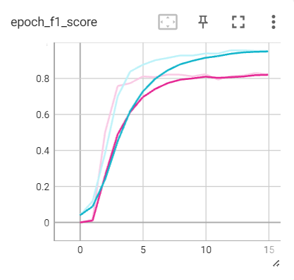

# Tweet Stance Classification
In this task, students are required to train an end-to-end deep neural network on the dataset provided by Saif M. Mohammad et al. (2016). The dataset consists of 2814 training and 1249 test set tweets. The dataset is originally used for “Semeval-2016 Task 6: Detecting Stance in Tweets” that lets participants classify Tweets that are about one of 6 Targets : 
- Atheism (AT)
- The Feminist Movement (FM)
- Climate Change is a Real Concern (CC)
- Legalization of Abortion (LA)
- Hilary Clinton (HC)
- Donald Trump (DT)

The best model achieved an F1 score of 63% on the test set, performing well on Stance FAVOR and AGAINST for most Target except CC and DT.

<figure>
    
    <figcaption>Model F1 Score across 30 Epochs</figcaption>
</figure>

To simulate the model’s performance on Real-world data, ChatGPT is used to generate 5 tweets for each Stance for 4 Targets namely Environmental Crisis, Political Discourse, Gender Equality, Religious Beliefs. Different Targets never seen are used to simulate the real-world data to test the model’s performance on. Unfortunately, the model achieved only 33% F1 score, indicating that the model is not suitable for deployment.

